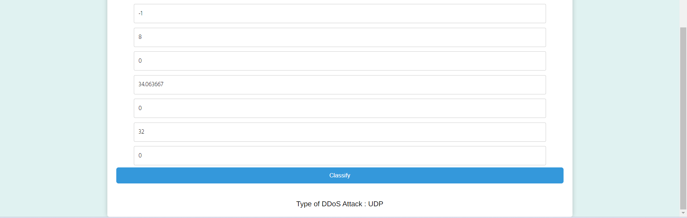
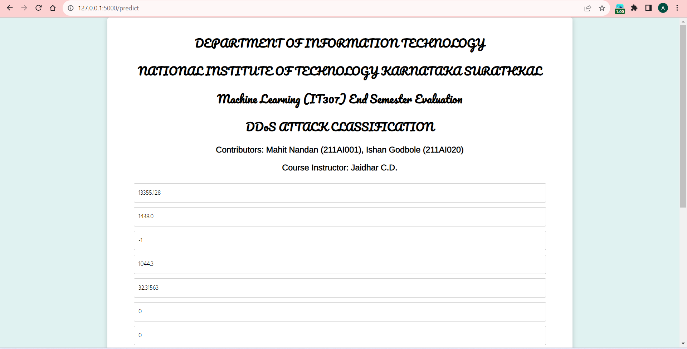

# IT307 Machine Learning Project End-Semester Evaluation - README

## Project Title
Classification of DDoS Attacks Using Feature Selection and Hyper-parameter tuning.

## Project Objectives:
a. Use Data Visualization Techniques and Feature Selection to understand the relationship between various features and type of attack.\
b. Compare models after hyperparameter tuning to access which accurately predicts the type of attack.\
c. Create a User Friendly Frontend for the Classification Task
## Team Members
- 211AI001 - A D Mahit Nandan
- 211AI020 - Ishan Godbole

## Dependencies
NumPy\
Pandas\
MatPlotLib\
Seaborn\
scikit-learn\
joblib\
flask

## DataSet
cicddos2019_dataset.csv - consists of 431473 rows and 81 features
fina.csv - obtained after removing unnecessary columns
Balanced_dataset.csv - obtained after performing sampling techniques

## Usage
After installing all required dependencies, the code can be executed sequentially. 
The Code consists of the following sections:\
a. EDA\
b. Feature Selection\
c. Modeling and Hyper-parameter tuning\
d. Saving the Model\
e. Create Frontend\
f. Use saved model to predict the type of DDoS Attack

## Frontend 

## Website

Click [here](https://ddosattackclassification.pythonanywhere.com/) see the project hosted online. 

## Run Locally

To run application locally open the Frontend folder and run the app.py file.

